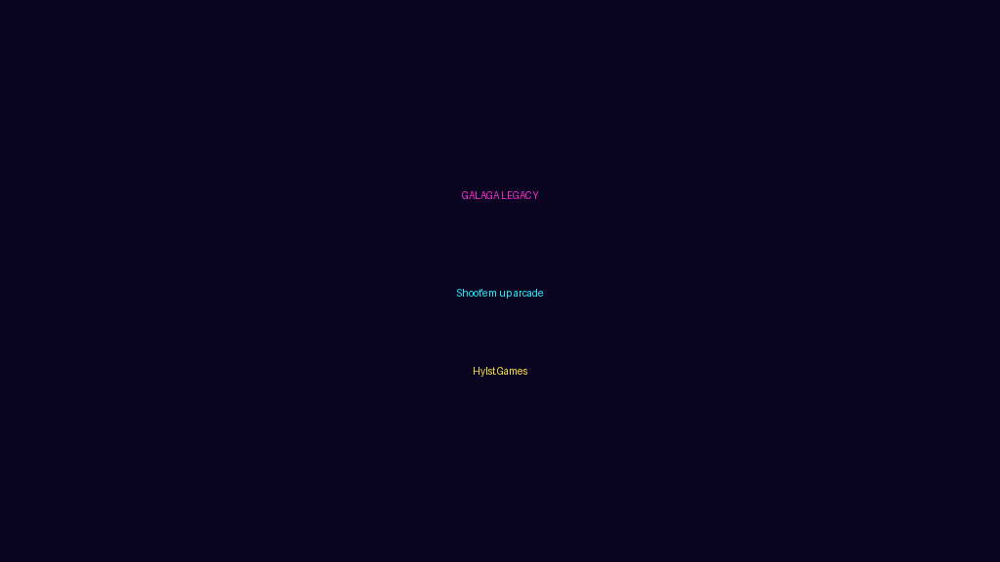

# Galaga Legacy

**Shoot'em up arcade rétro, vagues en formation et néons partout.**

Joue ici : [games.hylst.fr/galagalegacy/](https://games.hylst.fr/galagalegacy/)



## Comment on joue

Affrontez des vagues d'ennemis qui descendent en formation, débloquez des power-ups et
battez votre meilleur score. Déplacement horizontal, tir vertical, écran unique en Canvas.

## Contrôles

| Action | Effet |
|--------|-------|
| Flèches gauche/droite ou A/D (Q/D en AZERTY) | Déplacer le vaisseau |
| Espace | Tirer |
| Tactile | Glisser pour se déplacer, tapoter pour tirer |
| Bouton « ℹ️ Infos » | Stack technique, graphismes, algorithmes |

## Ce qu'il y a dedans

- Vagues d'ennemis en formation, patterns d'attaque à la Galaga
- Power-ups à ramasser en jeu
- Rendu Canvas 2D, boucle de jeu en `requestAnimationFrame`
- Musique et effets sonores synthétisés (Web Audio API)

## L'arborescence

```
galaga-style-arcade-shooter-1-game-development/
├── index.html          # template + bloc SEO
├── vite.config.ts      # base '/galagalegacy/' + singlefile
├── favicon.png
├── og-image.png
├── public/
└── src/
    ├── main.tsx
    ├── App.tsx          # UI, montage du Canvas
    ├── game/Game.ts      # boucle de jeu, entités, collisions
    ├── index.css
    └── utils/cn.ts
```

## Dev

```bash
npm install
npm run dev       # http://localhost:5173/
npm run build     # dist/index.html, un seul fichier
npm run preview
```

## Stack

React 19, TypeScript 5.9 (strict), Tailwind CSS 4, Vite 7, vite-plugin-singlefile.

## Licence

MIT, Geoffroy Streit (Hylst)
